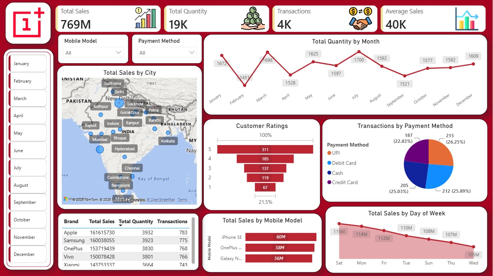
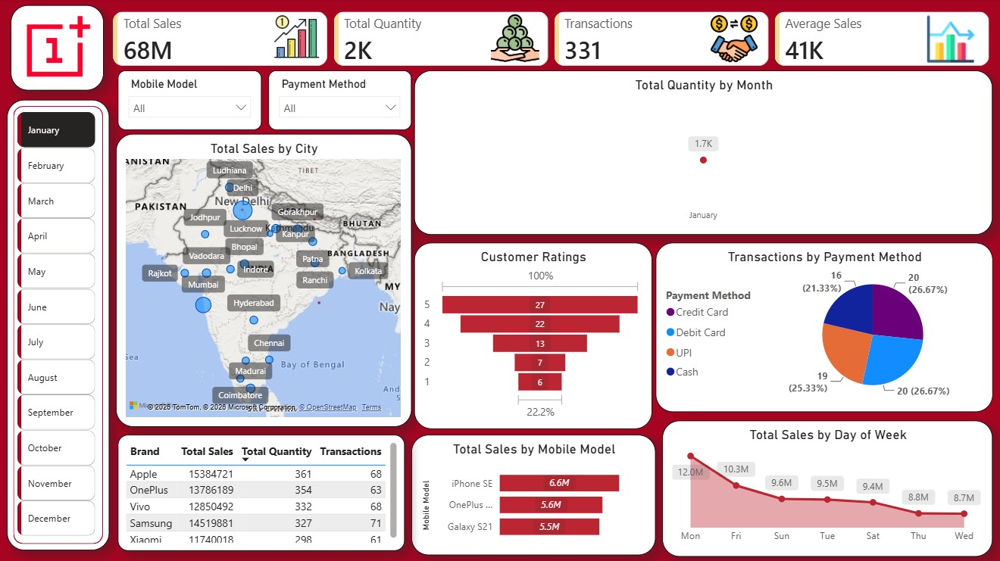
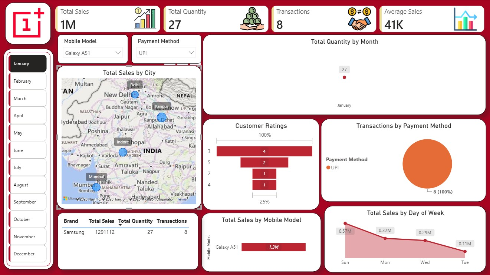
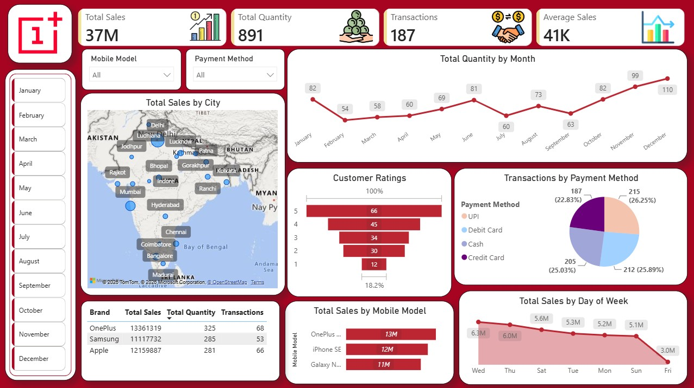

# 📊 Mobile Sales Power BI Dashboard


---

# 📌 Project Overview

The **Mobile Sales Power BI Dashboard** is an end-to-end **Business Intelligence** project built using **Power BI**, **Power Query**, **DAX**, and **Microsoft Excel** to transform raw sales data into meaningful business insights through interactive dashboards.

The dashboard provides a comprehensive view of mobile sales performance by analyzing key metrics such as **Total Sales, Total Quantity, Transactions, Customer Ratings, Payment Methods, Mobile Model Performance, City-wise Sales**, and **Monthly Sales Trends**.

This project demonstrates practical skills in **Data Cleaning, Data Modeling, Power Query, DAX, KPI Development, Interactive Dashboard Design, and Business Intelligence Reporting**, helping convert raw business data into actionable insights for decision-making.

---

# 🎯 Business Objectives

- Analyze overall mobile sales performance.
- Monitor key business KPIs.
- Identify top-performing mobile brands and models.
- Compare payment methods used by customers.
- Analyze customer ratings.
- Track monthly sales trends.
- Explore city-wise sales distribution.
- Build an interactive Business Intelligence dashboard.

---

# 📈 Key Performance Indicators (KPIs)

- 💰 Total Sales
- 📦 Total Quantity Sold
- 🤝 Total Transactions
- 📊 Average Sales

---

# 📊 Dashboard Features

- Interactive KPI Cards
- Monthly Sales Trend Analysis
- Sales by Mobile Model
- Brand-wise Sales Summary
- Customer Rating Analysis
- Payment Method Distribution
- City-wise Sales Map
- Interactive Slicers
- Dynamic Filtering
- Interactive Business Dashboard

---

# 🛠️ Tools & Technologies

- Microsoft Power BI
- Power Query
- DAX (Data Analysis Expressions)
- Microsoft Excel

---

# 📚 DAX Measures Used

- Total Sales
- Total Quantity
- Transactions
- Average Sales
- Month-to-Date (MTD)
- Quarter-to-Date (QTD)
- Year-to-Date (YTD)

---

# 📷 Dashboard Screenshots

## Dashboard Overview



---

## January Filter



---

## Multiple Filters



---

## Payment Method Filter



---

# 📂 Repository Structure

```text
Mobile-Sales-PowerBI-Dashboard
│
├── Mobile Sales Dashboard.pbix
├── Mobile Sales Data.xlsx
├── Dashboard-overview.jpg
├── Dashboard-january-filter.jpg
├── Dashboard-multiple-filters.jpg
├── Dashboard-payment-filter.jpg
└── README.md
```

---

# 💡 Skills Demonstrated

- Data Cleaning
- Data Transformation
- Data Modeling
- Power Query
- DAX
- KPI Development
- Dashboard Design
- Business Intelligence
- Interactive Reporting
- Data Visualization

---

# 🚀 Learning Outcomes

Through this project, I gained hands-on experience in:

- Building interactive dashboards using Power BI.
- Transforming raw data using Power Query.
- Creating business KPIs using DAX.
- Designing interactive reports using slicers and filters.
- Developing business-focused visualizations.
- Presenting actionable insights through dashboards.

---

# 👨‍💻 Author

## Yash Rajput

**Aspiring Data Analyst**

### 📬 Connect With Me

- 💻 **GitHub:** https://github.com/rajputyash16
- 💼 **LinkedIn:** https://www.linkedin.com/in/yash-rajput-7ab2a1277/

---

## ⭐ Support

If you found this project useful, please consider giving this repository a ⭐ on GitHub.

Thank you for visiting this project!
